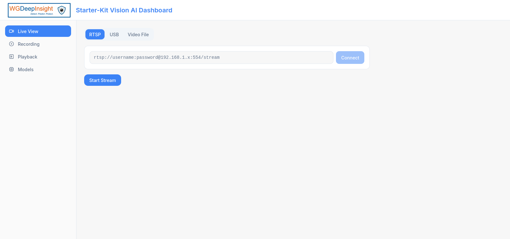
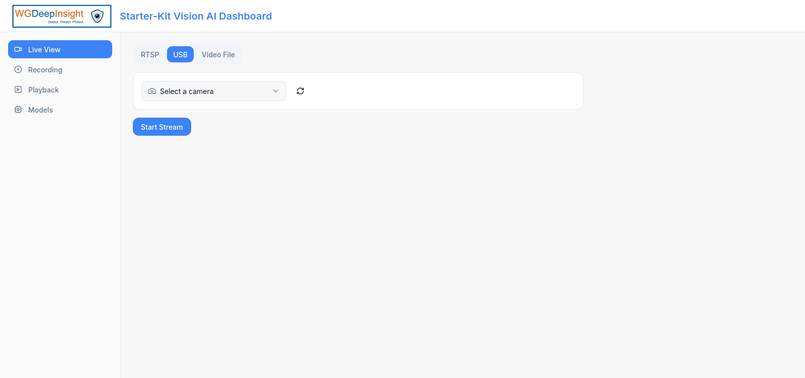
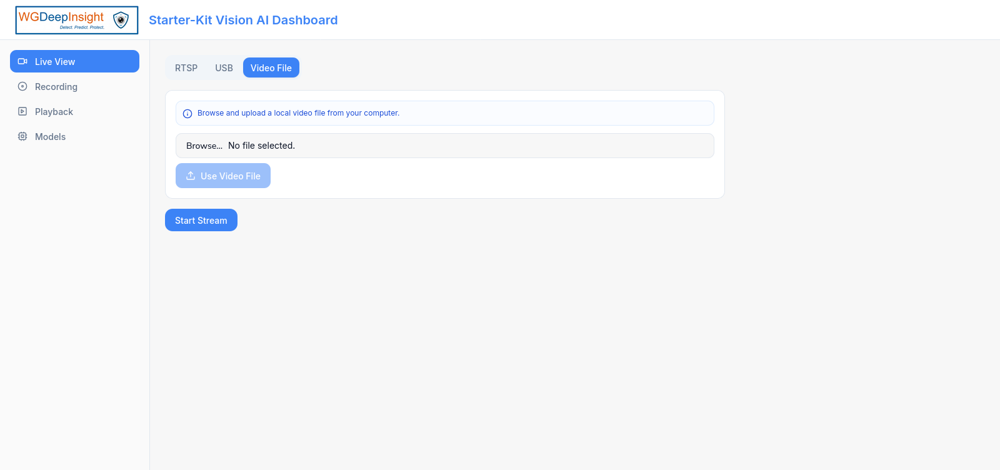
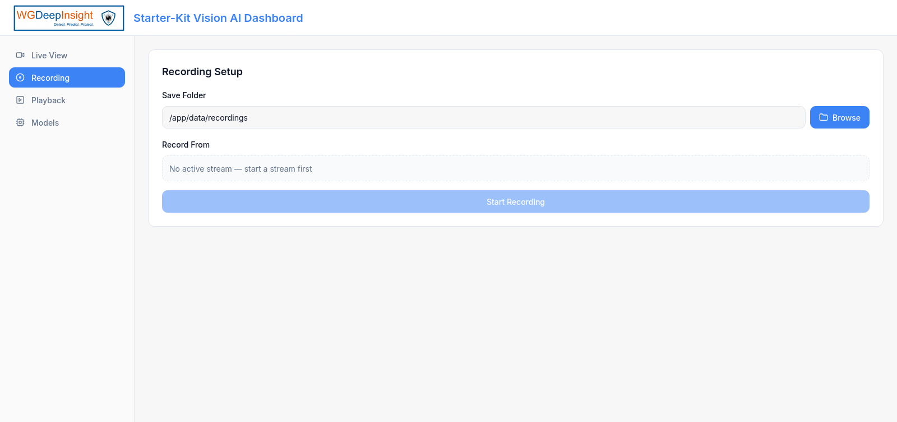
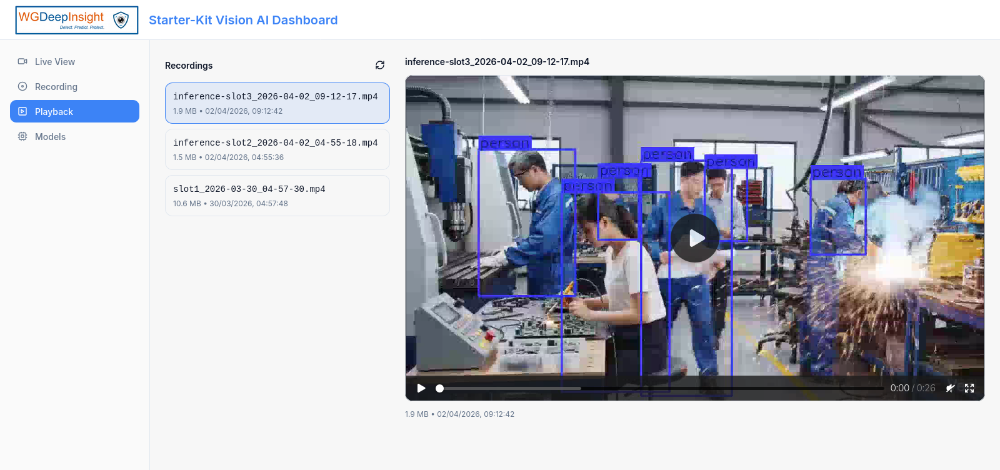
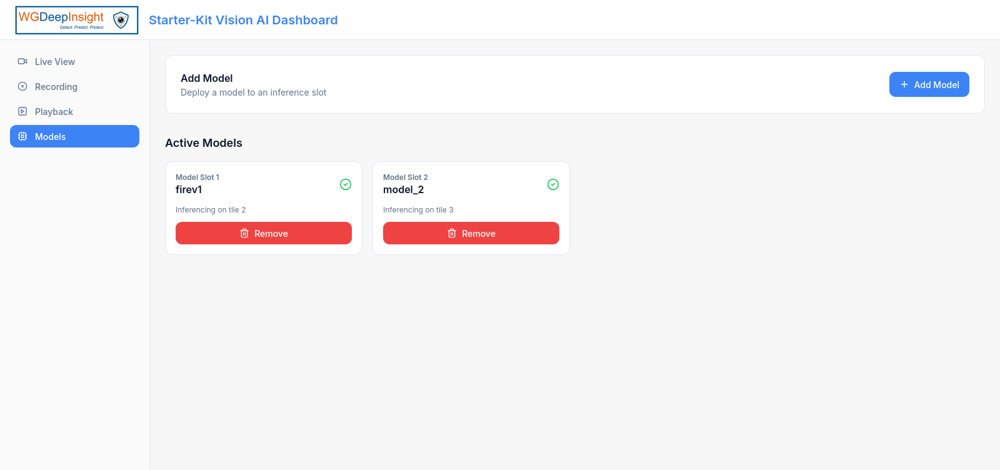
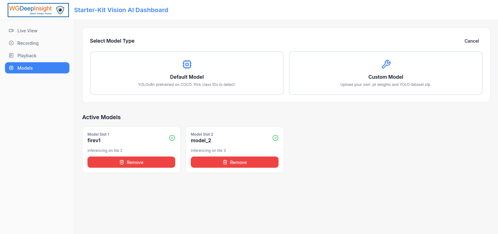
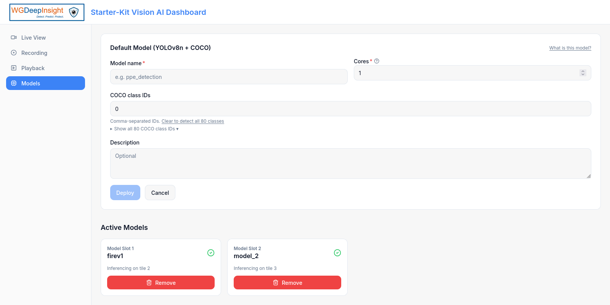
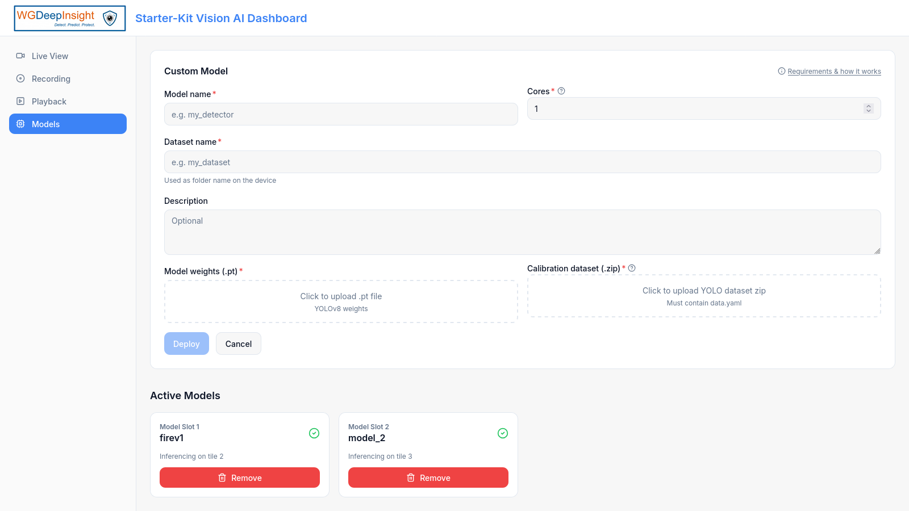
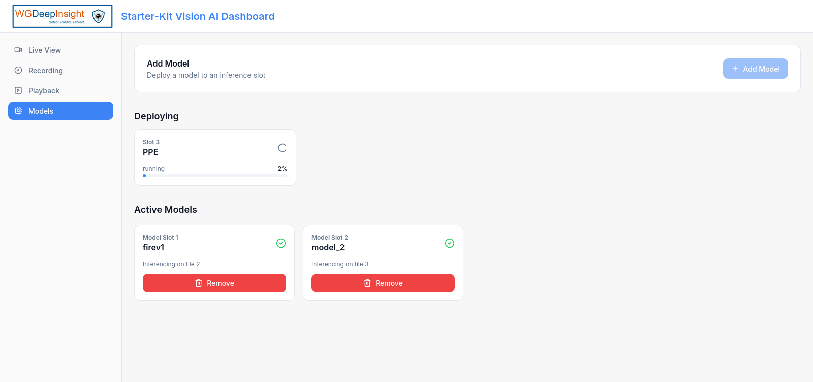

# WGtech Starter Kit — User Guide

## Overview

This document describes the application and is intended to help users understand and use the system effectively.

The application consists of four main pages:

---

## Live View Page

This is the default page. It is used to specify the type of input video stream for model inferencing and predictions.

On this page, input for the video stream is provided. There are three types of inputs available:

### 1) RTSP

Provide RTSP links of cameras within the same network. Using Ethernet is recommended for better stream stability.

**Steps:**
Enter RTSP link → Connect → Start Stream



Once an RTSP stream is entered, it is saved under **Saved Streams** for easier future access.

---

### 2) USB

If USB cameras are connected to the Raspberry Pi 5 USB ports, they can be accessed here.

**Steps:**
Select a camera (from the dropdown list) → Start Stream



If the USB camera is not visible in the application, use the refresh icon to reload available devices.

---

### 3) Video File

If `.mp4` files are present in the local storage of your computer, browse and input them here.

**Steps:**
Choose File → Use Video File → Start Stream



When the **Use Video File** button is clicked, a notification appears confirming the selected file (e.g., Ocean.mp4).

---

## Recordings Page

This page is used to save recordings. There is a default path where recordings are saved.

**Steps:**
Select Slot → Start Recording → Pause or Stop Recording




---

## Playback Page

This page is used to view recorded videos that were recorded in the Recordings page.

Select a recording from the list, and the video will be displayed on the right-hand side.



---

## Models Page

This page is used to manage models for inferencing.

The application includes a default model, YOLOv8 (You Only Look Once), pretrained on the COCO dataset. You can also upload your own custom models. Currently, any custom trained YOLO models with a dataset can be uploaded.



---

### Add Model

Click **Add Model**, then select the model type: Default Model or Custom Model.



---

### Default Model

**Fields required:**
- Model Name
- Cores
- COCO Class IDs
- Description



---

### Custom Model

**Fields required:**
- Model Name
- Cores
- Dataset Name
- Description
- Model Weights
- Calibration Dataset



---

### Deployment

Click **Deploy** to start the deployment process.



After clicking Deploy, the model appears under **Active Models** while deployment is in progress (typically 10–60 minutes).

To remove a model, use the remove option from any slot and confirm the action.

**Note:** Don't stop the application (run `./stop.sh` command) when model deployment is in process. 

---

## Getting Started

The system is now ready to be used.

Refer to `README.md` for setup and installation instructions. Once the application is running, this guide can be used to navigate and operate the system effectively.

---

## ❓ FAQs

### 1. Why is my RTSP stream not working?

Ensure that:
- The camera is on the same network as the Raspberry Pi
- The RTSP link is correct
- A stable Ethernet connection is used where possible

### 2. Why is my USB camera not showing up?

- Make sure the USB camera is plugged into one of the Raspberry Pi 5 USB ports
- Click the refresh icon in the USB section to reload available devices
- If it still doesn't appear, stop the application, plug the camera in, and run `./start.sh` again — USB camera detection runs at startup

### 3. Why is the model inference taking a long time to stream or display?

By default, model inference results should appear within a few seconds. If it is taking significantly longer, it may be due to temporary delays or system issues.

Try the following steps to resolve the issue:
- Refresh the dashboard page
- Stop the stream and start it again
- Restart the application:
  ```bash
  ./stop.sh
  ./start.sh
To check the Voyager SDK / inference server logs, run:
  ```bash
    docker exec voyager-sdk tail -f /tmp/ai_server.log  
```

### 4. How long does model deployment take?

Deployment typically takes 20–60 minutes depending on model size. The model will appear under **Active Models** during this time. Do not close the application while deployment is in progress.

### 5. Why is the application slow or laggy sometimes?

The application's performance depends on available processing power. On Raspberry Pi or other low-power systems, inference and multiple concurrent streams can cause latency. 

### 6. What video formats are supported for Video File input?

Currently `.mp4` files are supported. Use 1080p videos for best results.

### 7. Where are recordings saved?

Recordings are saved to the default path shown on the Recordings page. This maps to the `data/recordings/` folder in the Starter Kit directory on the Raspberry Pi.


### 8. Can I use Wi-Fi instead of Ethernet for RTSP streams?

Yes, but Ethernet is strongly recommended. Wi-Fi can introduce latency and packet loss which causes stream instability and dropped frames.


### 9. What should the Data.yaml contain?

The Standard format is like below-

path: ./model  
train: train/images  
val: valid/images  
test: test/images  
nc: 2  
names:   
&nbsp;&nbsp;&nbsp;0: fire  
&nbsp;&nbsp;&nbsp;1: spark  


