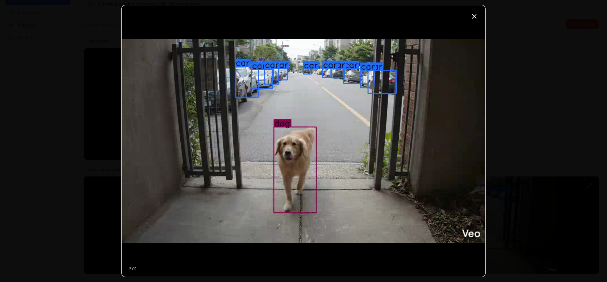
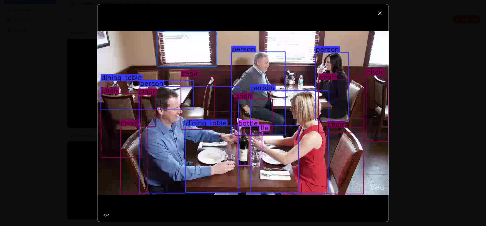

# Sample Videos Guide

This folder contains 2 sample videos where you can test the default YOLOv8n model with specific object classes (COCO dataset).

---

## Animals_City.mp4

**Classes to detect (COCO IDs):**
- 2 — Car  
- 3 — Motorcycle  
- 15 — Cat  
- 16 — Dog  

**Expected annotated output:**

---

## Restaurant.mp4

**Classes to detect (COCO IDs):**
- 0 — Person  
- 39 — Bottle  
- 41 — Cup  
- 56 — Chair  
- 60 — Dining Table  

**Expected annotated output:**

---

**Note:** Use 1080p videos for best results.